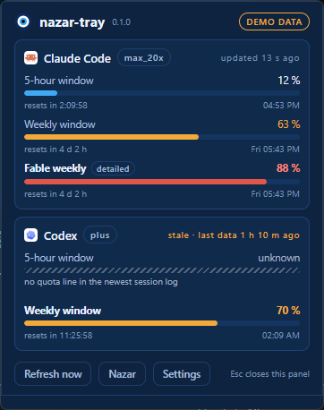
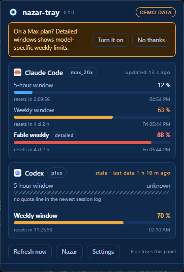
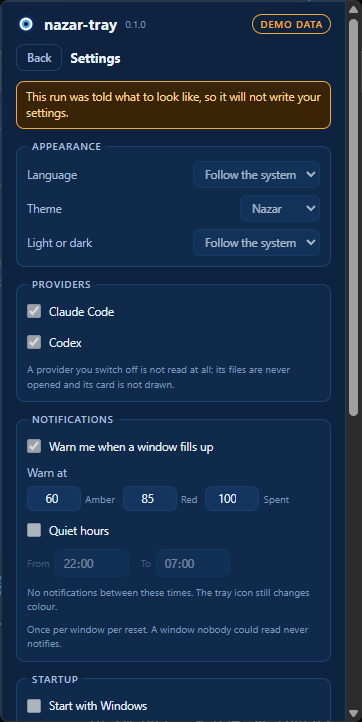
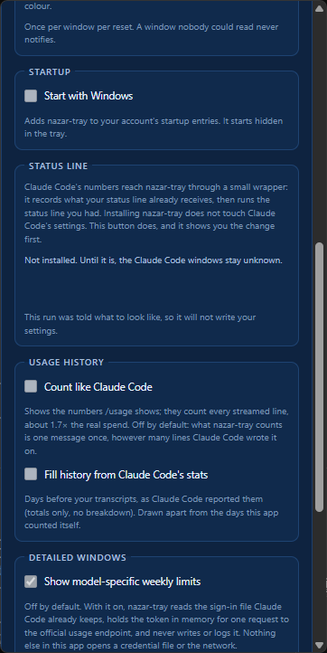
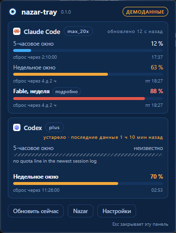

# 🧿 nazar-tray

**Your Claude Code and Codex quota, in the system tray. Zero credentials, zero network.** The tray face of [Nazar](https://github.com/xfurqan0/nazar).

A bead in your tray fills up as you burn through your 5-hour and weekly windows. Click it for the full picture: every window, its percentage, and when it resets. Amber at 60 %, red at 85 %, a notification before you hit the wall.

> Status: **release candidate (WP7) — not yet published.** Everything is here: both readers,
> the refresh loop inside the tray process, `~/.nazar/limits.json` written atomically by one
> process and only when the numbers have moved, the icon and the panel, notifications,
> autostart, settings, six languages, and now the installer, the winget manifests and the
> release pipeline. What has not happened is the release itself — no tag, no GitHub Release,
> no winget package — so the commands below describe the first release rather than one you can
> run today. Windows first; macOS and Linux builds later from the same codebase. See
> [docs/PROJECT.md](docs/PROJECT.md) for the v1 plan, [CHANGELOG.md](CHANGELOG.md) for what
> has landed, and [docs/RELEASE.md](docs/RELEASE.md) for what is left.



<sub>Demo data, so the picture shows the states that are hard to arrange on purpose: a window
over the amber threshold, one over the red threshold that only the opt-in detailed mode can
see, and one nobody could read — which says so rather than showing a reassuring zero. The
bead states at every scale: [docs/screenshots/wp4-icons.png](docs/screenshots/wp4-icons.png).</sub>

## Install

```powershell
winget install xfurqan0.nazar-tray
```

Windows 10 1809 or newer. It installs **per user**, into `%LOCALAPPDATA%\nazar-tray`, and asks
for no administrator rights. About 2 MB down, one Start Menu entry, and the tray icon
appears; nothing is added to Claude Code or to Codex, and nothing starts with Windows until
you switch it on.

Or take the installer from [Releases](https://github.com/xfurqan0/nazar-tray/releases) and run
it. Every release carries a `SHA256SUMS` file and a GitHub build attestation:

```powershell
Get-FileHash .\nazar-tray_0.1.0_x64-setup.exe -Algorithm SHA256
gh attestation verify .\nazar-tray_0.1.0_x64-setup.exe --repo xfurqan0/nazar-tray
```

**It is not code-signed, so a browser download raises SmartScreen** — "Windows protected your
PC", *More info → Run anyway*. `winget install` does not go through the browser and does not
raise it, which is why it is first on this page. The plan for a real certificate, why the
application to SignPath Foundation comes *after* the first release, and what you can verify in
the meantime: [docs/CODE_SIGNING.md](docs/CODE_SIGNING.md).

**Uninstalling** removes the program, the Start Menu entry, the startup entry and the
`StartupApproved` record Windows keeps beside it, and puts your status line back before it
deletes the wrapper. It keeps `~/.nazar` — `limits.json` is read by Nazar and the captures are
yours — and keeps `%APPDATA%\nazar` unless you tick *delete application data*, which a silent
uninstall never asks. Both are one `Remove-Item` away.

## Why another quota tray

There are many. This one is built on one rule:

**By default, nazar-tray never reads your tokens and never talks to the network.**

Every other quota tool reads your OAuth token, or even your browser cookies, from inside an unsigned binary, then calls an undocumented endpoint that rate-limits them. nazar-tray does neither by default, because the numbers are already on your disk:

- **Codex** writes its server-reported usage into every session log (`~/.codex/sessions/…/rollout-*.jsonl`).
- **Claude Code** hands the same numbers to your status line on every refresh. A tiny wrapper (`nazar-statusline`) records them and then runs whatever status line you already had, unchanged. It ships beside the tray and **installs itself into nothing**: you press a button in the settings page, it shows you the diff first, it takes a copy of `settings.json` before it writes, and removing it puts your own status line back exactly — [the section below](#the-status-line-wrapper).

That is the whole default data path: two local files in, one local `limits.json` out. The same file feeds the quota strip on the Nazar canvas.

**Detailed windows (opt-in).** Claude's status line only reports the 5-hour and the global weekly window. If you are on a Max plan, your real constraint may be a model-specific weekly window that only the official usage endpoint reports. Turn on *Detailed windows* in settings and nazar-tray will read the token Claude Code already stores, keep it in memory for a single request, and never write or log it. Off by default, and **asked once**: the passive path carries no plan name at all, so nazar-tray cannot tell whether you are on Max — which is why the banner is a question rather than an announcement, and why answering it either way settles it for good.



<sub>Asked once, answered for good either way. In this picture the weekly window the account
is actually constrained by is *Fable weekly, 88 %* — the one the passive path cannot see.</sub>

With the mode **off** — which is how it ships — nothing in nazar-tray opens a credential file or a socket, and a test poisons that file to prove it. With it **on**, this is the whole of it: `claudeAiOauth.accessToken` is read out of `~/.claude/.credentials.json` (which is never written), held in a wrapper that wipes itself and prints `<redacted>`, and sent as one `Authorization` header on a single 20-second `GET` to `api.anthropic.com/api/oauth/usage` — the endpoint your own `/usage` command calls. The answer becomes your model-scoped weekly windows, marked `detailed` in `limits.json`. The token is never written to a file, never logged and never put in an error message, and no response body reaches one either; a test runs the entire flow with a sentinel in place of the token and fails if it turns up anywhere but that header. When the endpoint says no, the last known numbers stay with a *stale* flag and the next attempt backs off — 1 s, 2 s, 4 s and so on to half an hour, or whatever `Retry-After` asked for. Your `refreshToken` is never read: refreshing is Claude Code's job. `nazar-tray --print --detailed` runs the mode once without switching it on. The full account, including where this sits against Anthropic's terms and why it is your call rather than the default, is in [docs/detailed-windows.md](docs/detailed-windows.md).

## What you get

- Tray bead icon showing your most-constrained window; grey means "unknown", never a false zero
- Popup panel with both providers, all windows, reset countdowns
- Notifications at 60 / 85 / 100 %, once per window per reset
- Themes (`nazar`, `graphite`), autostart, six UI languages (English, Türkçe, 中文, 한국어, Русский, Español)
- `nazar-tray --print` for scripts and for Linux, and `--print --write` to refresh
  `~/.nazar/limits.json` once without a tray running
- A **per-user installer** — no administrator rights, no service, no scheduled task — and an
  uninstaller that removes the startup entry, the record Windows keeps beside it, and the
  status-line wrapper's edit to Claude Code's settings

## Notifications

**The reason a quota tray exists is to warn you before you hit the wall**, and this is the
one thing the two Windows leaders do not do at all.

A toast when a window crosses 60 %, 85 % or 100 % — whatever you set the thresholds to —
**once per window per reset period**:

> **Claude Code · weekly window 85 %**
> Resets in 2 h 10 m

Five rules, so it is a warning rather than a nuisance:

- **It fires on the crossing, not while you are above it.** A window that sits at 90 % for
  four days says nothing more.
- **A restart does not repeat it.** The key is written to `alerts.json` before the toast is
  shown, so a tray that is closed and reopened stays quiet.
- **Starting up already above a threshold says so once**, and then stops — waiting for a
  crossing that has already happened would be silence exactly when it matters.
- **A window nobody could read never notifies.** No number, no warning: the icon goes grey
  and says so instead.
- **One toast per crossing.** A jump from 10 % to 91 % passes two thresholds; you get one
  sentence, and it says 85 %.

**Quiet hours** stop the interruption without stopping the tray: the crossing is still
recorded and the icon still changes colour, you just are not told about it at three in the
morning. Times are your own wall clock, and the range may wrap midnight.

**Clicking a toast does not open the panel.** Tauri's notification plugin does not hand an
application the click, so there is nothing to hook — the toast names the window it is about,
and the tray icon is one click away.

## Settings



In the panel, and from the tray menu's **Settings**:

| | |
|---|---|
| **Language** | Follow the system, or pick one. Applies to the panel, the tray tooltip, the menu and the notifications **without a restart**. |
| **Theme** | `nazar` or `graphite`, and light / dark / follow the system. |
| **Providers** | Claude Code and Codex, each on or off. **A provider you switch off is not read at all** — its files are never opened and its card is not drawn. |
| **Notifications** | On or off, the three thresholds, and quiet hours. |
| **Start with Windows** | Adds a startup entry for your account; nazar-tray starts hidden in the tray. The switch reads the registry back, so it agrees with Task Manager's Startup tab. |
| **Status line** | Whether the wrapper is Claude Code's status line, and the button that installs or removes it. It shows the diff first and writes nothing until you press again — [the section below](#the-status-line-wrapper). |
| **Detailed windows** | The opt-in mode described above, off by default, with the whole of what it reads written out beside the switch. |
| **Files** | Where `limits.json`, the status-line captures, your settings and the notification history live. |
| **About** | The version, and a button that brings the first-run tray-icon tip back. |

Everything is written to `%APPDATA%\nazar\config.json`, atomically, and **a form that does
not make sense is refused as a whole** — thresholds that do not climb get an error and your
old settings, not an error and a half-changed tray. Keys a newer version of nazar-tray wrote
are preserved when an older one saves. There is no separate switch for the startup entry in
that file: it lives in the registry, which is the thing that actually decides.

`nazar-tray --autostart on|off|status` does the startup entry from a terminal, for when the
panel will not open.

Everything is read and written by **one process**: no scheduled task, no launch agent, no
systemd timer, and no second copy of the app fighting the first one for the same file. The
tray refreshes itself every minute, notices a new reading within five seconds, notices that
your laptop has been asleep, and writes the file only when something changed — so a consumer
watching it is woken by news rather than by a timer.

## The status-line wrapper

Codex's numbers are already in a file on your disk. Claude Code's are not — they arrive in the
payload it hands your **status line**, on every refresh, and then they are gone. So there is a
second binary in the package, `nazar-statusline.exe`, which records that payload and then runs
the status line you already had, unchanged.



<sub>The settings page, scrolled to the status-line section. "Not installed" is what a fresh
machine says, and it is why the Claude Code windows read *unknown* until you press the
button.</sub>

**Installing nazar-tray does not install it.** Claude Code's `settings.json` belongs to Claude
Code and to you, and an installer that edited it would be editing a file you never mentioned,
on a machine where a broken `statusLine` is a broken prompt. Instead the settings page has a
button:

1. **Install status-line wrapper** runs `nazar-statusline install --dry-run` and prints the
   exact diff it would make — one key, `statusLine.command`, with `padding`, `refreshInterval`
   and everything else on the object kept.
2. **Write this change** does it, after taking a whole-file backup beside `settings.json` that
   it will never write over, and recording the command it replaced in
   `~/.nazar/statusline/chain.json`.
3. **Remove status-line wrapper** puts the previous `statusLine` object back byte for byte, or
   removes the key if there was none, and checks the result against that backup before writing.

It refuses, changing nothing, on invalid JSON, on a settings file whose top level is not an
object, and when it is already installed. Median cost measured on a real machine: **9.6 ms**
against a 50 ms budget.

Until it is installed, Claude Code's windows read *unknown* — grey, with a question mark, never
a reassuring zero.

**By hand, if the binary is gone.** Open `~/.nazar/statusline/chain.json`, copy the `previous`
object over `statusLine` in `~/.claude/settings.json`, or delete the `statusLine` key if
`previous` is absent. The backup beside the settings file
(`settings.json.nazar-bak-<stamp>`) is the same thing in whole-file form. Uninstalling
nazar-tray does this for you, before it deletes the wrapper.

The whole contract — what a capture holds, where it lives, why it is keyed by session id, and
what is deliberately *not* in `limits.json` — is in
[docs/statusline-wrapper.md](docs/statusline-wrapper.md).

## Known limits

Written down rather than discovered. Every one of these is a consequence of a decision that is
explained somewhere in this repository.

- **Claude numbers move only while a Claude Code session refreshes its status line.** Between
  sessions the tray shows the last value with its age and a countdown computed locally from
  `resets_at`. Quota does not burn while you are not using it, so this is honest rather than
  stale — but a number that is six hours old says so.
- **Model-scoped weekly windows need the opt-in mode.** The status-line payload carries the
  5-hour and the *global* weekly window and nothing else; verified live on a machine whose
  global weekly read 18 % while its Fable-only weekly was 23 %. If a model-specific cap is what
  actually constrains you, turn on **detailed windows** — and read
  [docs/detailed-windows.md](docs/detailed-windows.md) first, because it reads a token.
- **The passive path carries no plan name**, so nazar-tray cannot tell a Max account from a Pro
  one. That is why the detailed-windows offer is a question asked once rather than a banner
  that knows.
- **Codex's log format is not a documented contract.** `rollout-*.jsonl` is an internal file
  that can change without notice. The reader is schema-tolerant, keeps the last good value, and
  reports *unknown* rather than guessing; `docs/pinned-internal-formats.md` records every shape
  it has been seen in, with the version it was seen under.
- **Unsigned.** SmartScreen warns on a browser download. See
  [Install](#install) and [docs/CODE_SIGNING.md](docs/CODE_SIGNING.md).
- **Windows 11 hides new tray icons** in the `^` overflow. The first run says so and asks you
  to drag the bead onto the taskbar; the tip can be brought back from the settings page.
- **Clicking a notification does not open the panel.** Tauri's notification plugin does not
  hand the application the click, so there is nothing to hook. The toast names the window it is
  about, and the icon is one click away.
- **Linux has no tray popup**, from any toolkit, reliably — even the 21k-star CodexBar closed
  its Linux tray issue as not planned. The story there is `nazar-tray --print`, which emits the
  same document as a file, and the Nazar canvas that reads it.
- **One account.** `~/.nazar/limits.json` is a single file by design, frozen at v1 so that
  Nazar can depend on it. Multiple profiles are a v2 shape (`~/.nazar/limits/<profile>.json`)
  and are deliberately not squeezed into v1.

## Languages

**English · Türkçe · 中文 · 한국어 · Русский · Español.** nazar-tray follows your Windows
display language on the first run and can be set to any of the six in the settings — the
panel, the tray tooltip, the context menu and the notifications all change **without a
restart**.



<sub>The panel measures itself after every render and asks for a window that fits, so a
translation longer than the English original moves the layout rather than clipping it. One
picture per language: [`docs/screenshots/wp6-100-*.png`](docs/screenshots).</sub>

**Corrections are welcome as pull requests.** English and Turkish were written by hand;
Chinese, Korean, Russian and Spanish were **machine-translated first** and none has been
reviewed by a native speaker yet. Every string in the product lives in one flat JSON file per
language under [`ui/locales/`](ui/locales/README.md) — the panel bundles them and the Rust
side compiles the same files in, so there is no second copy of a word to keep in step. That
README has the review table, the rules a locale file has to keep, and what is deliberately
left in English.

## Roadmap

- v1: Windows (winget + GitHub Releases), Claude Code + Codex
- After v1: a code-signing certificate through SignPath Foundation, which asks that a project
  already be released — [docs/CODE_SIGNING.md](docs/CODE_SIGNING.md)
- v2: macOS build, multiple accounts, more providers
- Linux: CLI output and the Nazar canvas; a tray popup is not reliably possible on Linux today

## Development

Windows, because that is what v1 targets. `nazar-core` builds and tests on Linux and
macOS too, and CI keeps it that way.

**Prerequisites**

| Tool | Version | Why |
|---|---|---|
| Rust | stable, ≥ 1.85 | `rust-toolchain.toml` pins the channel and pulls `clippy` and `rustfmt` |
| MSVC Build Tools 2022 | with the C++ workload | there is no linker without it |
| WebView2 | already part of Windows 10 1803+ and Windows 11 | the panel runs in it |
| Node | 22 | builds the panel and runs its tests |
| `tauri-cli` | 2.x | `cargo install tauri-cli --locked` — only needed for `tauri build` and `tauri icon` |

**Layout**

```
crates/nazar-core       the limits.json contract, its writer and reader. No Tauri.
                        `--no-default-features` drops the opt-in detailed-windows mode
crates/nazar-statusline the status-line wrapper and its installer. Three dependencies,
                        no Tauri: it runs on every status-line refresh
crates/nazar-tray       the Tauri v2 app: tray icon, panel window. Windows first.
ui/                     the panel: plain TypeScript, HTML and CSS, bundled by esbuild
fixtures/               limits.sample.json, the file consumers copy into their tests
packaging/winget/       the three manifests the winget package is submitted as
scripts/                the build, the licence gate, the notices, the bead rasteriser
                        and the screenshot runner
docs/                   the plan, the contracts, the release checklist, screenshots
```

**Everyday commands**

```powershell
cd ui; npm ci; npm test          # builds ui/dist, then runs the panel tests
cd ..
node scripts/sidecar.mjs --debug # the second binary, where tauri-build looks for it
cargo test --workspace
cargo clippy --workspace --all-targets -- -D warnings
cargo fmt --all
node scripts/check-licenses.mjs
node scripts/third-party-notices.mjs --check
```

Two of those are easy to skip and both fail confusingly. **The panel is built before the Rust
side**, because `tauri::generate_context!` reads `ui/dist` at compile time. **The sidecar is
prepared before anything compiles `nazar-tray`**, because `bundle.externalBin` names
`nazar-statusline` and `tauri-build` checks the file is there — so a missing sidecar fails
`cargo clippy` and `cargo test`, not only the bundler.

No test in this repository **writes** outside a directory it made itself, reads sign-in
material, or reaches the network. `NAZAR_HOME` moves the whole data directory, which is what
makes the first of those true rather than merely intended. (`nazar-tray --print`'s own tests
do *read* whatever this machine has under `~/.codex` and `~/.nazar/statusline`, because their
whole point is that the output is a valid document on a real computer — which is also why
none of them asserts a number.)

**Running it**

`ui/dist` must exist before the Rust side builds, and nothing builds it implicitly:

```powershell
cd ui; npm run build; cd ..
node scripts/sidecar.mjs --debug
cd crates/nazar-tray
cargo tauri dev
```

**Building the installer** — one command, because the order of the four things it does
matters: the panel, then `THIRD-PARTY-NOTICES.md` from the lock file, then the sidecar, then
the bundler. It prints the artefacts with their sizes and SHA-256 at the end.

```powershell
node scripts/build-installer.mjs           # release; --debug for a quick check
```

The NSIS toolchain is downloaded by the Tauri bundler on first use; nothing else has to be
installed. What comes out is `target/release/bundle/nsis/nazar-tray_<version>_x64-setup.exe`:
a per-user installer, no elevation, carrying the two binaries, `LICENSE.txt` and
`THIRD-PARTY-NOTICES.md`. [docs/RELEASE.md](docs/RELEASE.md) is the checklist that turns one
of those into a release.

**Regenerating the icons** — after editing `ui/assets/bead.svg`:

```powershell
node scripts/render-bead-png.mjs
cargo tauri icon ui/assets/bead-1024.png -o crates/nazar-tray/icons
```

That is the **application** icon: the installer, the taskbar, the Store logos. The **tray**
icon is not a file at all — it is drawn at run time by `crates/nazar-tray/src/icon.rs` for
the current scale factor, from the hexes in `ui/theme.nazar.json`. The strip in the
documentation comes from the same code:

```powershell
cargo run -p nazar-tray -- --icons docs/screenshots
```

**Regenerating the screenshots**

```powershell
cargo build -p nazar-tray
powershell -File scripts/screenshot.ps1
```

Every picture in `docs/screenshots` comes from that one command. It runs the tray with
`--demo`, which uses synthetic numbers, opens the panel at start-up, **never takes the
advisory lock and writes nothing** — so a screenshot session cannot overwrite the real
`~/.nazar/limits.json` or change your settings. 150 % and 200 % are rendered at those scales
rather than upscaled: WebView2 is passed `--force-device-scale-factor` and the window is
multiplied to match, so no display setting has to be touched. `-Theme`, `-Mode`, `-Hint`, `-Offer`,
`-View`, `-Locale` and `-Out` take one picture of one state. `-Hint` and `-Offer` exist
because the first-run tip and the Max-plan offer are each shown once per machine, which
makes them the states a screenshot cannot otherwise reach twice. The documented set ends with
the same panel in all six languages (`wp6-100-*.png`), which is how a translation that no
longer fits the layout gets noticed.

**Watching a threshold being crossed**

```powershell
cargo run -p nazar-tray -- --demo-cross
```

Steps one window through `80 → 86 → 86 → reset → 86` a few seconds apart. What should appear
is one toast at 60 %, one at 85 %, **nothing** for the repeat, and one more at 85 % after the
reset. It implies `--demo`: it takes no lock, writes nothing, and its notification history is
in memory, so it cannot consume a real warning you have not been shown yet.

## Credits

The original panel layout was inspired by
[Win-CodexBar](https://github.com/nesszer/Win-CodexBar) — the idea, not the code, and none of
its Apple-grey styling survived the redraw. Provider icons from
[@lobehub/icons](https://github.com/lobehub/lobe-icons) (MIT,
[`ui/assets/LICENSE-lobehub.txt`](ui/assets/LICENSE-lobehub.txt)); the Claude Code and Codex
marks belong to their owners and are used to identify the two products whose numbers the panel
shows, with no endorsement implied. Built with [Tauri](https://tauri.app).

Every other dependency, with its licence and its copyright holders, is in
[THIRD-PARTY-NOTICES.md](THIRD-PARTY-NOTICES.md), generated from the lock file and shipped
inside the installer.

## Contributing

[CONTRIBUTING.md](CONTRIBUTING.md) has the rules; the shortest useful one is that translations
are welcome and need no issue first — four of the six languages were machine-translated and
none has been reviewed by a native speaker. Security reports go through
[GitHub's private reporting](https://github.com/xfurqan0/nazar-tray/security/advisories/new),
not a public issue: [SECURITY.md](SECURITY.md).

## License

MIT — [LICENSE](LICENSE). Copyright (c) 2026 Furkan Yıldız.
